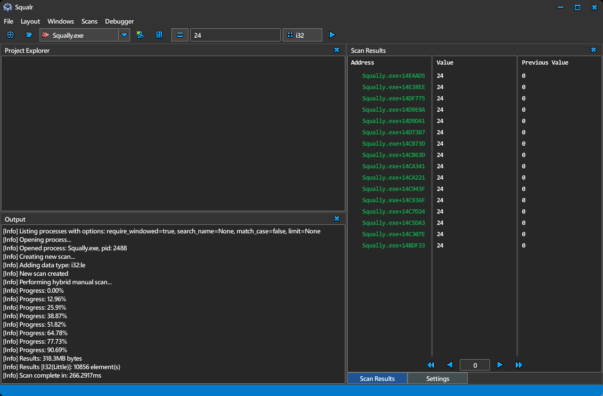

## Notice

This project is currently being ported from its former C# implementation to Rust. Squalr 4.0 is currently unreleased and in active development. Check back later.

# Squalr

[Squalr Official Website](https://www.squalr.com)

Join us on our [Discord Channel](https://discord.gg/Pq2msTx)

**Squalr** is performant Memory Editing software that allows users to create and share cheats in their windows desktop games. This includes memory scanning, pointers, x86/x64 assembly injection, and so on.

Squalr achieves fast scans through multi-threading combined with SIMD instructions. To take advantage of these gains, your CPU needs to have support for SSE, AVX, or AVX-512.

Additionally, Squalr has been rewritten from the ground up in Rust.

## Pre-launch tasklist
This is a slight brain dump, but more or less contains everything preventing the launch of the first version of this rewrite.

For platforms like Android, Squalr runs in a dual process mode with an unprivileged GUI and a privileged shell (given that the device has been rooted). The privileged shell obviously does most of the heavy lifting. This naturally gives rise to a command/response architecture, which makes for clear separation of concerns, but is a headache in other ways.

Additionally, we want to support CLI, which is actually pretty easy to do, since we're already going for the command/response thing. This just adds 1 more step of making all commands structopts, and all API structs implementing FromStr. From here, we just dispatch the raw commands users input, and implement handlers for all the responses that simply output to the console.

Unsolved architectural challenges:
- Some form of property viewer. This is better than building bespoke editors everywhere. While Rust lacks reflection natively, we can probably leverage named fields / serialization for structs we wish to edit. That said, generally property viewers allow registering pop-up window editors, aaaaaand now we're back to bespoke editors. Pop-up windows are not valid for platforms like Android, so we need to think this through more.
- Registry architecture needs work. It would be nice if this was 0 latency (ie exists on unprivileged GUI for mobile), but then this breaks our command/response pattern. Then again, this doesn't need privileges, so perhaps this could just live on both sides. But two sources of truth is pain. So alas, still need to dwell on this.
- Task management system is similarly annoying. Tasks are spawned and tracked by the engine, but the client needs to be able to cancel them, track their progress, and potentially get their result objects. Unclear what the simplest approach is that is still easy to reason about.
- Defining all ways that information goes to and from the engine needs work. Right now we have Commands/Responses (call engine, get a response), and Events (listen for broadcasts from engine). This is technically enough, but these alone make it hard to implement things like the task system mentioned above. ie how does a task send progress updates? It dispatches an event, and then every single event handle gets the events for all other task handles? This can be solved by having yet another task handle manager on the client side, but building more infra to solve infra problems may indicate that the problem needs to be solved at a lower level.
- Where do settings live? Obviously these are backed by serialized files, but again, we find ourselves wrestling command/response again. Two copies that must be kept in sync? Query the settings from the engine on boot? One source of truth is generally preferred, but now a simple settings look-up can end up being a command. Tedious. Currently these live exclusively on the engine side, and the client is not using settings directly.
- Can engine events be hooked? If we support plugins later, this might prove valuable. But lambdas are stored almost exclusively as FnOnce for easier stack capture.

Note the pattern above -- the command/response architecture, primarily inflicted upon us by Android, repeatedly gives rise to the same problem. Task management, Registry, and settings all have the same issue of both the privileged/unprivileged processes needing access to shared state.

I would prefer not to have to solve this problem 3 separate times.

Features:
- [ ] Auto updater (trivial, there is a Rust crate that does github release updates)
- [X] Dockable window system.
- [X] Command/Response system, with IPC support for rooted Android devices.
- [X] Scan result display.
- [X] Integer Scans.
- [X] Float Scans.
- [X] Big Endian Scans.
- [X] Vector Aligned Scans.
- [ ] HexDecBox support for entering scan values (similar to C# version).
- [ ] Sparse Scans (probably done, needs testing).
- [ ] Vectorized cascading scans (periodic).
- [ ] Projects with a per-file backing. Freezable addresses. Sortable.
- [ ] Freezing/deleting scan results directly from scan window.
- [ ] Array of byte scans.
- [ ] Property viewer.
- [ ] String scans.

## Post-launch tasklist
Lower priority features that we can defer, for now.

Features:
- [ ] Pointer Scans
- [ ] Memory viewer
- [ ] Vectorized cascading scans (non-periodic) -- not pre-launch required as we can just fall back to byte array scans for this.
- [ ] Plugin system for new data types. The engine is already designed with this feature in mind, so actually this should be fairly easy.
- [ ] Plugin system to support emulator middleware (ie filtering queried virtual memory, remapping virtual address space, etc).
- [ ] Plugin system to support virtual modules. Very similar to above, but registering fake modules, with emulators again being the primary use case.
